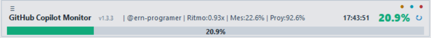
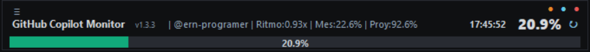
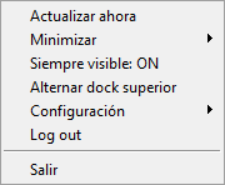
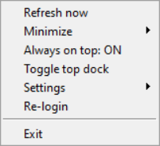
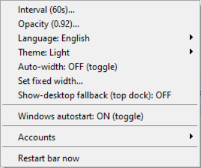

# GitHub Copilot Usage Visual Bar (Python)

This project shows a movable floating bar on Windows with your monthly GitHub Copilot Premium requests usage.

Project overview for GitHub: see [DESCRIPCION_GITHUB.md](DESCRIPCION_GITHUB.md).

## Quick Start (2 minutes)

```bash
git clone https://github.com/ern-programer/monitor-github-copilot.git
cd monitor-github-copilot
setup_entorno.bat
iniciar_monitor_github.bat
```

## What It Shows

- Current monthly usage percentage
- Slim visual progress bar
- Movable always-on-top window (drag with mouse)
- Pace metrics on the same line as premium usage
- Optional mini mode
- Configurable opacity
- Auto-width based on content
- Optional top dock mode
- Configurable always-on-top behavior
- Taskbar compact mode (150x30, bar + percentage)
- Taskbar mini variant (70x30)
- Taskbar medium variant (100x30)
- Multi-account mode in one window (stacked bars)
- Plan status (when available on GitHub)
- Monthly reset note (when available)
- Usage pace vs month progress
- End-of-month projection

## Requirements

- Python 3.10+
- GitHub account with Copilot access

## Installation

Recommended for end users (double-click):

```bash
setup_entorno.bat
```

This script creates `.venv`, installs dependencies, and downloads Playwright Chromium.

Manual installation:

```bash
pip install -r requirements.txt
python -m playwright install chromium
```

See details in `DEPENDENCIAS_USUARIO.md`.

## Usage

First run (save session):

```bash
python copilot_usage_monitor.py --login
```

No ENTER needed: once login is complete and Copilot Features opens, session is saved automatically.

Start visual bar:

```bash
python copilot_usage_monitor.py --gui --interval 60
```

Quick override:

```bash
python copilot_usage_monitor.py --gui --mini --opacity 0.85
```

Extra examples:

```bash
python copilot_usage_monitor.py --gui --dock-top --auto-width
python copilot_usage_monitor.py --gui --free-dock --fixed-width --width 520
python copilot_usage_monitor.py --gui --not-always-on-top
python copilot_usage_monitor.py --gui --taskbar-compact
python copilot_usage_monitor.py --gui --taskbar-compact --taskbar-compact-70
python copilot_usage_monitor.py --gui --taskbar-compact --taskbar-compact-100
python copilot_usage_monitor.py --gui --extra-state-files ".auth\\account2.json;.auth\\account3.json"
```

In multi-account mode:

- Normal view: one bar per account (stacked)
- Compact taskbar mode: account carousel
- Single click in compact mode: move to next account
- Double click in compact mode: restore normal view

Account assistant:

```bash
python copilot_usage_monitor.py --add-account account2
python copilot_usage_monitor.py --remove-account account2
python copilot_usage_monitor.py --remove-account account2 --delete-state-file
python copilot_usage_monitor.py --list-accounts
```

You can also use double-click assistants:

```bash
agregar_cuenta_copilot.bat
quitar_cuenta_copilot.bat
```

Note: removing an account updates `extra_state_files` by default. Use `--delete-state-file` to also remove `.auth\\alias.json`.

Windows launcher (double-click):

```bash
iniciar_monitor_github.bat
```

If Playwright Chromium is missing, the launcher installs it automatically.

## In-App Shortcuts

- Right click: refresh, re-login, exit
- Right click: minimize to tray
- Right click: toggle always-on-top
- Right click: toggle compact taskbar mode
- Right click: switch compact width (70/100/150)
- Right click: toggle top dock
- Right click: `Settings` menu for interval, opacity, auto-width, fixed width, autostart, language and theme
- Right click: `Settings > Accounts` to list/add/remove without editing files
- Right click: `Settings > Restart bar now` to apply changes immediately
- Header button `≡`: opens same context menu
- Tray: Restore, Refresh, Exit
- Escape: close bar (disabled in compact taskbar mode)

## Screenshots

Main bar (light theme):



Context menu (Spanish):



Compact taskbar mode:


Main bar (dark theme):



Context menu (English):



Settings menu:



## Persistent Configuration

Edit `monitor_config.ini` or use in-app `Settings`.

- `interval_seconds`: refresh interval in seconds
- `mini_mode`: `true` or `false`
- `opacity`: `0.35` to `1.0`
- `auto_width`: `true` or `false`
- `dock_top`: `true` or `false`
- `window_width`: base width in pixels
- `always_on_top`: `true` or `false`
- `taskbar_compact_mode`: `true` or `false`
- `taskbar_compact_width`: `70`, `100`, or `150`
- `theme`: `dark` or `light`
- `language`: `en` or `es`
- `extra_state_files`: semicolon-separated extra sessions
- `auto_start_enabled`: `true` or `false` for Windows startup

## Windows Autostart

```bash
configurar_autoarranque_windows.bat on
configurar_autoarranque_windows.bat off
configurar_autoarranque_windows.bat status
configurar_autoarranque_windows.bat apply
```

`apply` reads `auto_start_enabled` from `monitor_config.ini` and updates the current user registry key.

## Lightweight Distribution Package

```bash
paquete_release.bat
```

Creates `dist_liviano` with required end-user files and `dist_liviano.zip` ready to share.

## Important Notes

- For personal accounts, GitHub does not provide a stable public API endpoint for this real-time value; the app reads your authenticated settings page.
- If session expires, run with `--login` or use in-app re-login.
- If GitHub changes page text/selectors, extraction patterns may need updates.

## Contributing

Contributions are welcome: bug fixes, UX improvements, docs, and platform support.

- Contribution guide: [CONTRIBUTING.md](CONTRIBUTING.md)
- Code of conduct: [CODE_OF_CONDUCT.md](CODE_OF_CONDUCT.md)
- Project roadmap: [ROADMAP.md](ROADMAP.md)

Suggested contribution flow:

1. Fork the repository.
2. Create a branch for your change.
3. Validate locally.
4. Open a pull request with context and test notes.

If you build custom variants, feel free to share your fork and open PRs so others can benefit.
